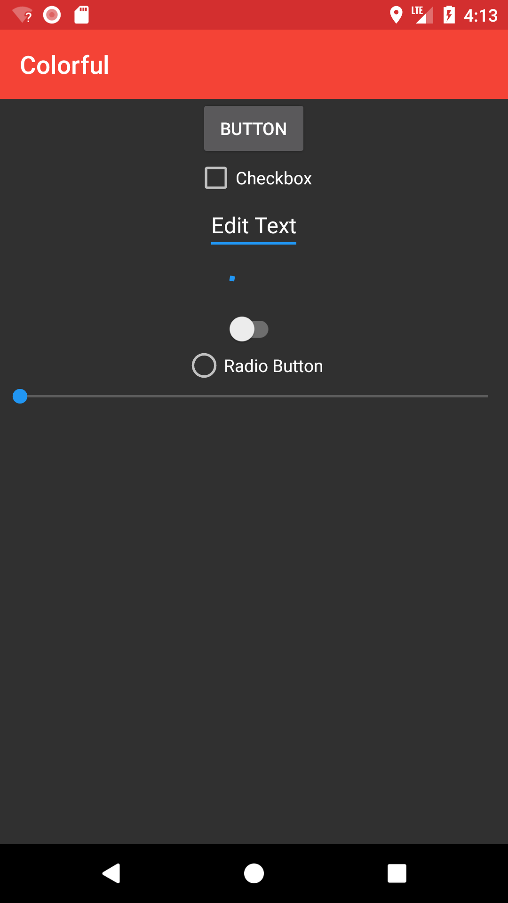
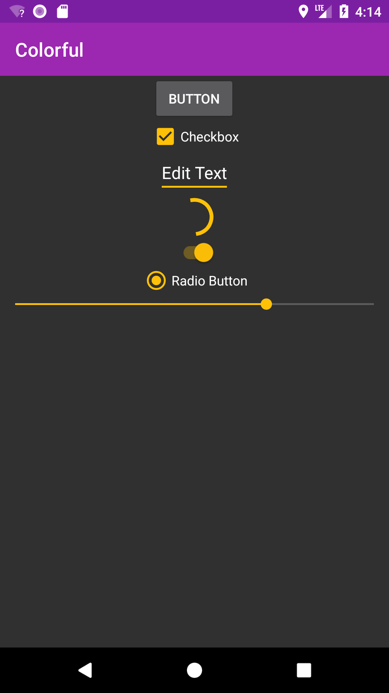
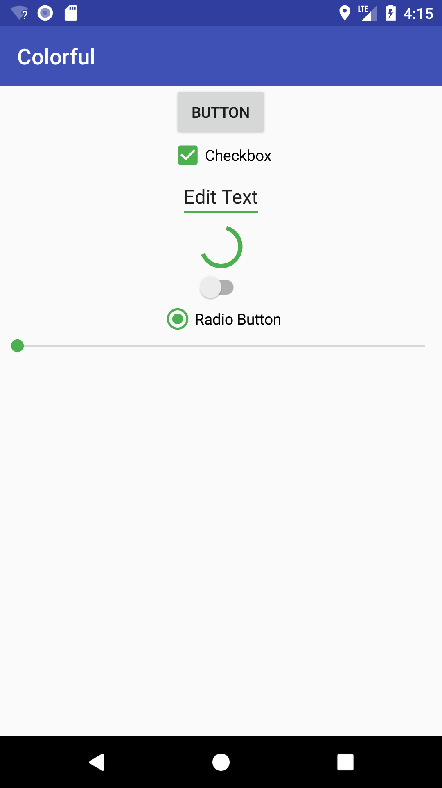

# Colorful
[](https://jitpack.io/#garretyoder/Colorful) [](https://travis-ci.org/garretyoder/Colorful)


Colorful is a dynamic theme library allowing you to change your apps' color schemes easily.

*Colorful v2 is here! v2 has been rewritten from the ground up in Kotlin to be lighter, faster, and more feature-packed*

## License

Colorful is licensed under the Apache 2.0 License

Copyright 2018 Garret Yoder

|                                    |                                    |                                    |
| ---------------------------------- | ---------------------------------- | ---------------------------------- |
|   |   |   |

## Installation
Add jitpack to your maven sources
```groovy
allprojects {
    repositories {
        ...
        maven { url "https://jitpack.io" }
    }
}
```
Add Colorful as a dependency to your `build.gradle`
```groovy
dependencies {
    implementation 'com.github.garretyoder:Colorful:2.3.4'
}
```

## Usage

### Initialization

In your `Application` class, you must initialize Colorful and set the default theme colors.
```kotlin
class SampleApp:Application() {
    override fun onCreate() {
        super.onCreate()
        val defaults:Defaults = Defaults(
                primaryColor = ThemeColor.GREEN,
                accentColor = ThemeColor.BLUE,
                useDarkTheme = false,
                translucent = false)
        initColorful(this, defaults)
    }
}
```
The following is a list of all theme colors available. 
```kotlin
ThemeColor.RED
ThemeColor.PINK
ThemeColor.PURPLE
ThemeColor.DEEP_PURPLE
ThemeColor.INDIGO
ThemeColor.BLUE
ThemeColor.LIGHT_BLUE
ThemeColor.CYAN
ThemeColor.TEAL
ThemeColor.GREEN
ThemeColor.LIGHT_GREEN
ThemeColor.LIME
ThemeColor.YELLOW
ThemeColor.AMBER
ThemeColor.ORANGE
ThemeColor.DEEP_ORANGE
ThemeColor.BROWN
ThemeColor.GREY
ThemeColor.BLUE_GREY
ThemeColor.WHITE
ThemeColor.BLACK
```

### Using Themes

Any `Activity` you wish to be automatically themed must inherit from either `CActivity`, `CAppCompatActivity` if you wish to use AppCompat or `CMaterialActivity` if you wish to use the new Material Componets theme. *Note* The material componets theme is still beta and is available only in the testing android-p branch. To use the material-componets theme, please add the android-p colorful branch to your gradle build.
```kotlin
class MainActivity : CActivity()
```
```kotlin
class MainActivity : CAppCompatActivity()
```
*Only available in the android-p branch*
```kotlin
class MainActivity : CMaterialActivity()
```
If you wish to use your own activity, you can manually apply Colorful's theme to any activity using `apply(activity:Activity)`
```kotlin
Colorful().apply(this, override = true, baseTheme = BaseTheme.THEME_MATERIAL)
```
The `override` value will control whether Colorful overrides your activitie's existing base theme, or merely sets primary and accent colors. **Note**: dark/light themeing will not work when override is disabled
The `baseTheme` value will control which base theme Colorful will use, Appcompat, Material, or Material Componets.

Alternatively, as of Colorful 2.1, you can now have your activity inherit from the interface `CThemeInterface` which will provide the `handleOnCreate` and `handleOnResume` methods for automatic theme handling.
See both [CActivity](https://github.com/garretyoder/Colorful/blob/master/library/src/main/java/io/multimoon/colorful/CActivity.kt) and [CAppCompatActivity](https://github.com/garretyoder/Colorful/blob/master/library/src/main/java/io/multimoon/colorful/CAppCompatActivity.kt) for examples on how to implement the `CThemeInterface`

### Setting The Theme

You can set the colors at any time using the `edit()` method
```kotlin
Colorful().edit()
        .setPrimaryColor(ThemeColor.RED)
        .setAccentColor(ThemeColor.BLUE)
        .setDarkTheme(true)
        .setTranslucent(true)
        .apply(context:Context)
```
You must call `apply(context:Context)` to save your changes

`primaryColor` the primary color of your theme. This affects componets such as toolbars, task descriptions, etc
`accentColor` the accent color of your theme. This affects componets such as buttons, sliders, checkboxes, etc
`darkTheme` the base theme of your style. This controls whether the theme is dark or light.
`translucent` This controls whether translucency is enabled. This will turn the status bar translucent or solid

Colorful will handle saving and loading your theme preferences for you.

The `apply` method optionally takes a high-order function as a argument. This serves as a callback that will be triggered once Colorful has finished it's theme changes. A example usage would be to recreate the current activity after setting a new theme to immediately reflect changes.
```kotlin
Colorful().edit()
    .setPrimaryColor(ThemeColor.PURPLE)
    .setAccentColor(ThemeColor.GREEN)
    .apply(this) { 
        this.recreate() 
    }
```

### Getting the current theme values

Colorful can provide you with hex string, or android rgb int formatted values for the currently set colors. This is acheived through the `ColorPack` class, which is a pack that contains both dark and normal variants of the color. These are based off the Material Color Pallet 500 (normal) and 700 (dark) values. Examples are shown below.
```kotlin
Colorful().getPrimaryColor().getColorPack().dark().asInt()
Colorful().getAccentColor().getColorPack().normal().asHex()
```
`Colorful().getDarkTheme()` will return a `boolean` value for whether the dark theme is enabled

`Colorful().getTranslucent()` will return a `boolean` value for whether the current style has transluceny enabled.


### Custom styles

Colorful has beta support for combining your own styles with it's own. This is not yet guaranteed to work reliably. 
```kotlin
Colorful().edit()
                .setPrimaryColor(ThemeColor.RED)
                .setAccentColor(ThemeColor.BLUE)
                .setDarkTheme(true)
                .setTranslucent(true)
                .setCustomThemeOverride(R.style.AppTheme)
                .apply(this)
 ```
 The `setCustomThemeOverride` method will allow Colorful to mix a provided theme with it's own. If you wish to set specific theme items yourself, such as coloring all text orange, you can do this within a style file and then have Colorful merge it with it's own theme.

### Custom theme colors

Colorful allows you to define custom themes (e.g. light red primary color with dark yellow accents). If you want to use custom styles you have to do following 3 things:

1. create styles for your custom themes:

```kotlin
<style name="my_custom_primary_color">
	<item name="android:colorPrimary">@color/md_red_200</item>
	<item name="colorPrimary">@color/md_red_200</item>
</style>
<style name="my_custom_primary_dark_color">
	<item name="android:colorPrimaryDark">@color/md_red_400</item>
	<item name="colorPrimaryDark">@color/md_red_400</item>
</style>
<style name="my_custom_accent_color">
	<item name="android:colorAccent">@color/md_yellow_700</item>
	<item name="colorAccent">@color/md_yellow_700</item>
</style>
```
 
 2. Create a custom theme color object, like following:
 
```kotlin
var myCustomColor1 = CustomThemeColor(
	context,
	R.style.my_custom_primary_color,
	R.style.my_custom_primary_dark_color,
	R.color.md_red_200, // <= use the color you defined in my_custom_primary_color
	R.color.md_red_400 // <= use the color you defined in my_custom_primary_dark_color
)
// used as accent color, dark color is irrelevant...
var myCustomColor2 = CustomThemeColor(
	context,
	R.style.my_custom_accent_color,
	R.style.my_custom_accent_color,
	R.color.md_yellow_700, // <= use the color you defined in my_custom_accent_color
	R.color.md_yellow_700 // <= use the color you defined in my_custom_accent_color
)
```
  
3. use this custom theme color object like you would use any `ThemeColor.<COLOR>` enum object, e.g.
 
```kotlin
var defaults = Defaults(
	primaryColor = myCustomColor1,
	accentColor = myCustomColor2,
	useDarkTheme = true,
	translucent = false,
	customTheme = 0
)
```
