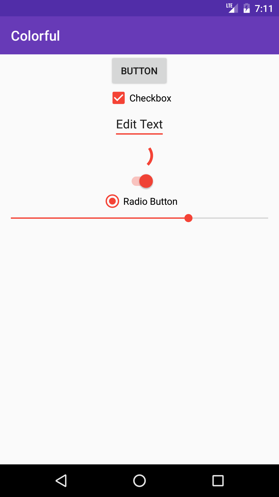
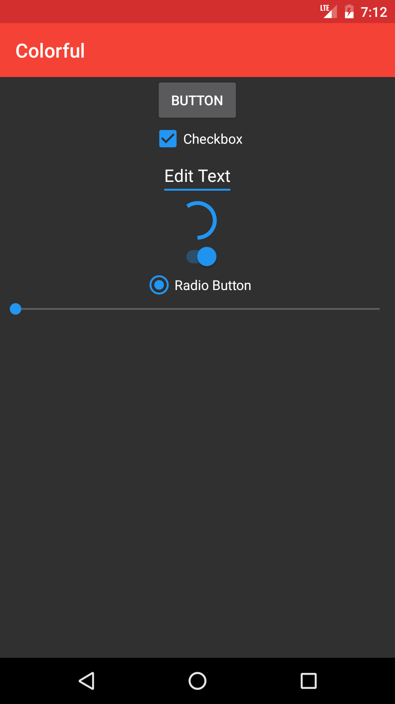

# Colorful
[](https://jitpack.io/#garretyoder/Colorful)


Colorful is a dynamic theme library allowing you to change your apps' color schemes easily.


## License

Colorful is licensed under the Apache 2.0 License, in common Android style.

Copyright 2016 Garret Yoder


## Installation
Add jitpack to your maven sources
```groovy
allprojects {
    repositories {
        ...
        maven { url "https://jitpack.io" }
    }
}
```
Add Colorful as a dependency to your `build.gradle`
```groovy
dependencies {
    compile 'com.github.garretyoder:Colorful:1.1'
}
```

## Usage

In your `Application` class, you must initialize Colorful
```java
public class SampleApp extends Application {
    @Override
    public void onCreate() {
        super.onCreate();
        Colorful.init(this);
    }
}
```
Any `Activity` you wish to be themed must extend from `CActivity`
```java
public class MainActivity extends CActivity
```

Alternatively you can call the following method after `super.onCreate(savedInstanceState);` and before `setContentView();`
```java
Colorful.applyTheme(Activity activity);
```

You can also use `Colorful.applyTheme(Activity activity, Boolean overrideBase);` where `overrideBase` defines whether you want `Colorful` to override your base theme as well, or simply set the primary and accent colors. This allows you to use Colorful with your own pre-defined style, but *will* break light/dark functionality.

You can set the default theme colors Colorful will use with the `defaults()` method
```java
public class SampleApp extends Application {
    @Override
    public void onCreate() {
        super.onCreate();
        Colorful.defaults()
                .primaryColor(Colorful.ThemeColor.RED)
                .accentColor(Colorful.ThemeColor.BLUE)
                .translucent(false)
                .dark(true);
        Colorful.init(this);
    }
}
```
You can set the colors at any time using the `config` method
```java
Colorful.config(this)
                .primaryColor(Colorful.ThemeColor.RED)
                .accentColor(Colorful.ThemeColor.BLUE)
                .translucent(false)
                .dark(true)
                .apply();
```
After which you must call `apply();` to save your changes

Colorful will handle saving and loading your theme preferences for you.

## Color Chooser

Colorful has a inbuilt color chooser dialog that will return a `ThemeColor` object you can pass directly to Colorful
```java
public class MainActivity extends CActivity {

    @Override
    protected void onCreate(Bundle savedInstanceState) {
        super.onCreate(savedInstanceState);
        setContentView(R.layout.activity_main);
        setSupportActionBar(((Toolbar) findViewById(R.id.toolbar)));

        ColorPickerDialog dialog = new ColorPickerDialog(this);
        dialog.setOnColorSelectedListener(new ColorPickerDialog.OnColorSelectedListener() {
            @Override
            public void onColorSelected(Colorful.ThemeColor color) {
                //TODO: Do something with the color
            }
        });
        dialog.show();
    }
}
```

## Preference Item
Colorful has a inbuilt preference item that will automatically set Colorful's colors.

Use `colorpicker:primary_color` and `colorpicker:accent_color` to tell Colorful which value to set.
```xml
        <org.polaric.colorful.ColorPickerPreference
            android:title="@string/primary_color"
            android:summary="@string/primary_color_desc"
            colorpicker:primary_color="true"/>

        <org.polaric.colorful.ColorPickerPreference
            android:title="@string/accent_color"
            android:summary="@string/accent_color_desc"
            colorpicker:accent_color="true"/>
```
           

## Screenshots

